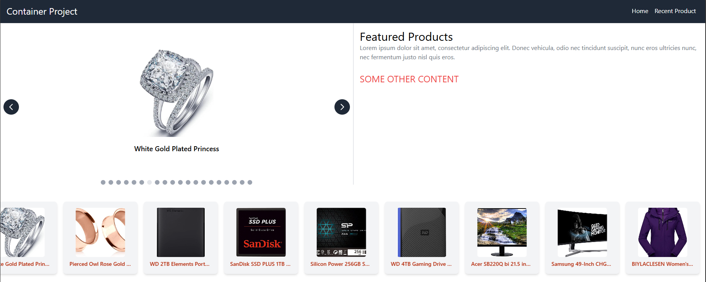
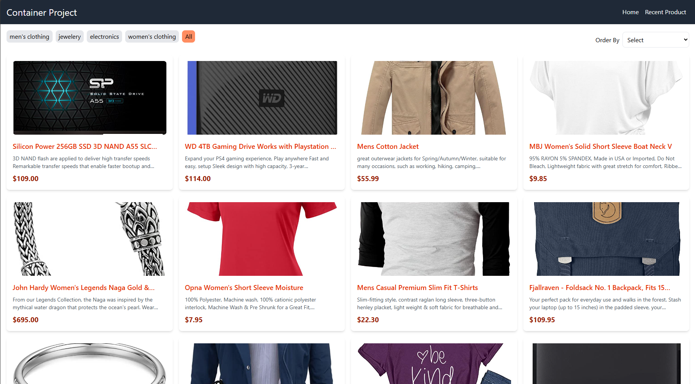

# Microfrontend Technology

In this repository, we will explore the microfrontend technology and how to implement it in a multiple frontend frameworks like React, Vue, and Svelte.

Our task to create 3 different microfrontends from [Mart](mart.ps) website, with the different frontend frameworks.

## Microfrontend

- [React](./react) Product Grid and Sorting/Filtration
- [Vue](./vue) Product Slider
- [Svelte](./svelte) Trusted Business

## Perquisites

- Node.js 18.x
- NPM
- Docker (optional)
- Docker Compose (optional)

## How to run

1. Clone the repository

```bash
git clone https://github.com/CBSE-summer2024/team9
```

2. Go to the repository directory

```bash
cd team9
```

3. Run each microfrontend

```bash
cd product-grid && npm install && npm run bundle
cd product-slider && npm install && npm run bundle
cd trusted-business && npm install && npm run bundle
```

4. Run the container

```bash
cd container-project && npm install && npm run dev
```

4. if you lazier you can use the bellow one-liner command to run the whole microfrontend, you can run the following command

```bash
cd team9 && npm install && ./build-and-run.sh
```

which internally runs the following commands

```bash
# Install all dependencies
npm install --prefix ./product-grid
npm install --prefix ./product-slider
npm install --prefix ./trusted-business
npm install --prefix ./container-project

# Run the project
npm run start:all
```

4. Open your browser and go to [http://localhost:8080](http://localhost:8080)

## Screenshots




## Demo Video

[Demo Video](https://drive.google.com/file/d/1dVnp_qDMgQMPyXGAzk4K49ONdRC_7laX/view?usp=sharing)

## Deployment

unfortunately, we didn't deploy the project yet, but you can run it locally by following the above steps, demonstrate how will run the project on the server.

## Tech Stack

**Client:** React, Vue,Svelte, TailwindCSS

**Server:** We don't have a server, we are using a mock API from [fakestoreapi](https://fakestoreapi.com/products)

## Authors

- [Loai Masri](https://github.com/LoaiMasri1)
- [Ahmad Omar](https://github.com/AhmadOmar1)
- [Mahmoud Jawabreh](https://github.com/Mahmoud-Jawabreh)
- [MohammadAbuzahid](https://github.com/MohammadAbuzahid)

## References

- [Microfrontend](https://micro-frontends.org/)
- [Mart](https://mart.ps)
- [Vite](https://vitejs.dev/)
- [Module Federation](https://webpack.js.org/concepts/module-federation/)
- [Vite Plugin Module Federation](https://github.com/originjs/vite-plugin-federation)
