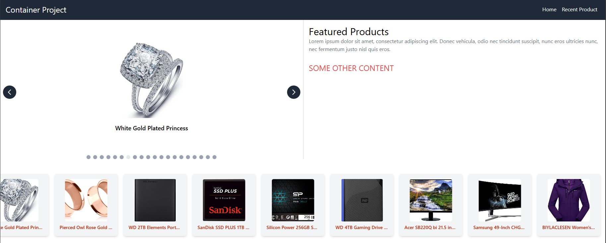

# Container Project

This is a container project that contains all the other microfrontends.

## How we will do it

1. Create a React project
2. Create a Container component for Svelte and Vue
3. Install module federation plugin

```bash
npm install @originjs/vite-plugin-federation
```

4. Import the remote components

```javascript
import { defineConfig } from "vite";
import federation from "@originjs/vite-plugin-federation";

export default defineConfig({
  plugins: [
    react(),
    federation({
      remotes: {
        ReactApp: "http://localhost:5001/assets/remoteEntry.js",
        VueApp: "http://localhost:5002/assets/remoteEntry.js",
        SvelteApp: "http://localhost:5003/assets/remoteEntry.js",
      },
      shared: ["react", "react-dom", "vue", "svelte"],
    }),
  ],
});
```

5. run the project

```bash
npm run dev
```

## Screenshots



