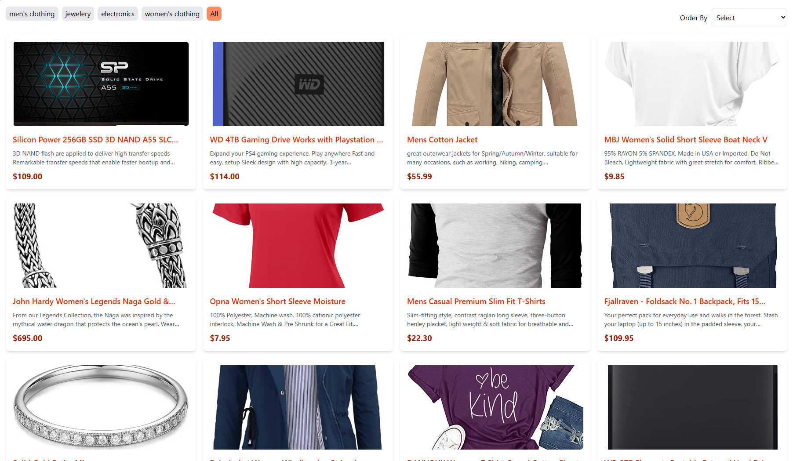

# Product Grid

In this project, we will create a microfrontend for the product grid section from the [Mart](mart.ps) website using the React framework.

## How we will do it

1. Create a React project
2. Create a Product Grid component
3. Fetch the data from the API
4. Display the data in the Product Grid component
5. Bundle the project

```bash
npm run bundle
```

## How to use module federation in React

1. Install the `@originjs/vite-plugin-federation` package
2. Add the plugin to the Vite configuration

```javascript
import { defineConfig } from "vite";
import federation from "@originjs/vite-plugin-federation";

export default defineConfig({
  plugins: [
    federation({
      name: "productGrid",
      filename: "remoteEntry.js",
      exposes: {
        "./ProductGrid": "./src/ProductGrid.jsx",
      },
    }),
  ],
});
```

3. Import the remote component in the container project

## How to run the project

```bash
npm run dev
```

## Screenshots


